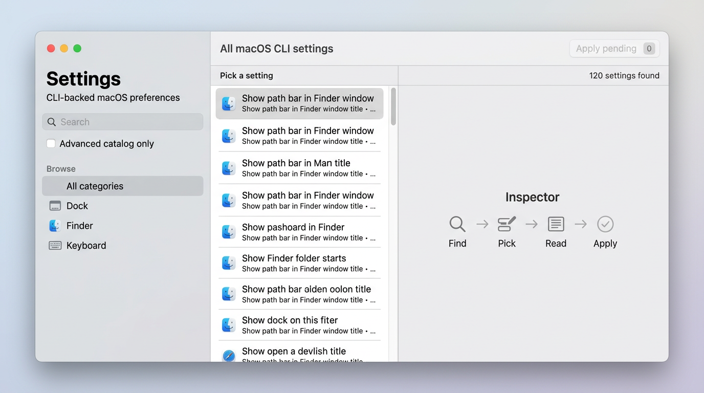
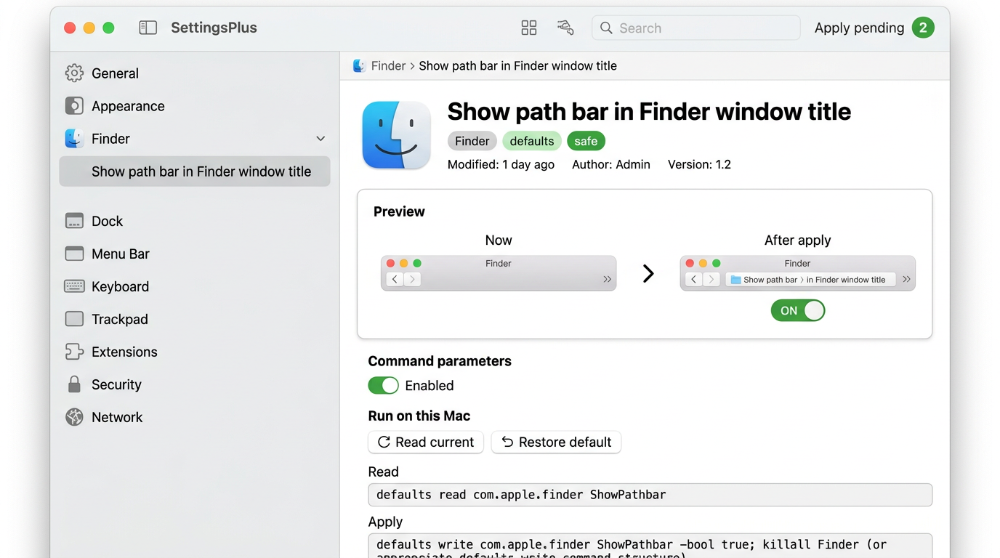

# SettingsPlus

**The switches Apple never put in System Settings.** SettingsPlus is a focused macOS app that surfaces **hidden Finder, Dock, keyboard, network, and power tweaks**—the kind you’d normally hunt for in random forum posts. Browse a clear catalog, see **before / after** previews, stage a bunch of changes, and apply when you’re happy. A few deeper changes ask for your Mac password the same way any serious settings tool does.

**Requirements:** macOS only (this is a real Mac utility, not a cross-platform toy). The app won’t start on other OSes unless you set `SETTINGSPLUS_ALLOW_NON_DARWIN` for UI hacking (see below).

## About this repo

This project is **100% AI-generated**—one of those “someday I’ll build this” ideas that sat in the backlog until I had an assistant crank out a working version. Treat it as a scratchpad / experiment, not a statement of craftsmanship or a promise of maintenance.

## Screenshots

Browse the catalog and empty inspector when nothing is selected:



Inspector with preview, parameters, and toolbar batch apply:



*(Images are stylized README previews, not guaranteed pixel-perfect to your local build.)*

## Disclaimer

This software can change system and user preferences, restart UI services, log you out, or reboot your Mac when you ask it to. You are responsible for what you run. There is no warranty; see [LICENSE](LICENSE).

### Gatekeeper (unnotarized downloads)

Releases are **not** Apple-notarized. After you mount the DMG, **double-click `Open first time.command`** next to the app — it runs `xattr -cr` on the bundle (clears the download quarantine flag) and launches SettingsPlus. Same pattern a lot of indie / sideloaded macOS software uses.

If you already dragged the app to **Applications**, run once in Terminal (then open from Launchpad or Spotlight as usual):

```bash
xattr -cr /Applications/SettingsPlus.app
```

(`~/Applications` works too if you put it there.)

## Development

```bash
npm ci
npm run dev
```

- **Typecheck:** `npm run typecheck`
- **Unit tests:** `npm run test`
- **Production bundle (no installer):** `npm run build`
- **Packaged app (unsigned):** `npm run dist` writes `release/mac-<arch>/SettingsPlus.app` (see [electron-builder.yml](electron-builder.yml)). DMG builds (CI) include **`Open first time.command`** on the disk image; see [Gatekeeper](#gatekeeper-unnotarized-downloads) above.

### Where are the builds?

Two different places on GitHub—easy to mix up:

1. **Actions → workflow run → Artifacts** (zip download at the bottom of a run).  
   On every push to `main` / `master`, [`.github/workflows/macos-dmg.yml`](.github/workflows/macos-dmg.yml) builds three **unsigned** DMGs and uploads them as **`SettingsPlus-dmgs-*`** artifacts. Names follow **`SettingsPlus-X.Y.Z.dmg`** (universal — default, best for almost everyone), **`SettingsPlus-X.Y.Z-silicon.dmg`** (Apple Silicon only), **`SettingsPlus-X.Y.Z-intel.dmg`** (Intel only). Each DMG includes **`Open first time.command`** (runs `xattr` then opens the app). Nothing is posted to the **Releases** tab from this workflow.

2. **Releases** (what the in-app “newer version” check uses).  
   GitHub’s API only lists **published releases**. Those are created by [`.github/workflows/release-github.yml`](.github/workflows/release-github.yml) when you push a **version tag** whose name starts with `v`:

   ```bash
   # After bumping "version" in package.json and committing:
   git tag v0.1.1
   git push origin v0.1.1
   ```

   That run builds the same three DMGs and attaches them to a new release for that tag (via `softprops/action-gh-release`).

Packaging uses [electron-builder.workflow.yml](electron-builder.workflow.yml) in CI (DMG only). Local `npm run dist` still uses the `dir` target from [electron-builder.yml](electron-builder.yml).

### Non-macOS guard

For limited UI work on another OS, you can bypass the platform check (commands will still not match a real macOS environment):

```bash
SETTINGSPLUS_ALLOW_NON_DARWIN=1 npm run dev
```

## Security

See [SECURITY.md](SECURITY.md).

## License

MIT — see [LICENSE](LICENSE).
